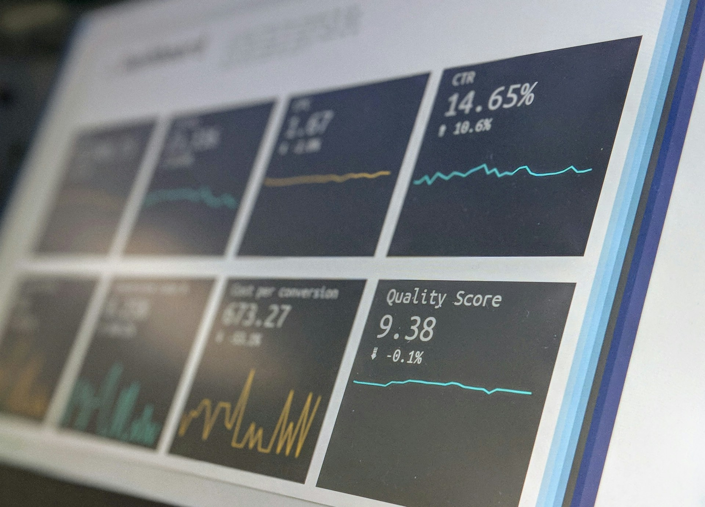

# How to Choose the Right AI Consulting Company for Your Business

April 7, 2025

[What Does an AI Consulting Company Do?](#what-does-an-ai-consulting-company-do)[How Much Does an AI Consulting Company Charge?](#how-much-does-an-ai-consulting-company-charge)[Why Choose Artificial Intelligence Consulting?](#why-choose-artificial-intelligence-consulting)[How to Choose the Right AI Consulting Company for Your Business](#how-to-choose-the-right-ai-consulting-company-for-your-business)[Final Thoughts](#final-thoughts)

In 2023 alone, businesses worldwide spent over [$154 billion on AI solutions](https://www.statista.com/statistics/1446052/worldwide-spending-on-ai-by-industry/#:~:text=Worldwide%20spending%20on%20AI%2Dcentric,of%2019.7%20billion%20U.S.%20dollars.), and that number is expected to double by 2027. Banking and retail are among the top industries, taking advantage of their vast and valuable data for workflow automation, predicting customer behavior, and more.

But, surprisingly,[7 out of 10 companies see no impact from Artificial Intelligence](https://sloanreview.mit.edu/projects/winning-with-ai/) due to poor AI strategy and execution. That’s why more and more companies are starting to look for an Artificial Intelligence consulting services. The right experts help them avoid costly mistakes, implement AI solutions the smart way, and actually see results.

How do you find the right artificial intelligence consulting partner, and what do they do? Let’s break it down.

## What Does an AI Consulting Company Do?

The main role of an AI consultant is to identify AI opportunities that will surely fit your business, processes, and targets. Consultants analyze your business and pinpoint where AI can increase efficiency, improve customer experience, or cut costs. They do extensive preliminary research to plan exactly what positive outcomes you can expect from AI technologies.

For example, consultants may reveal that AI-driven chatbots can handle 80% of your routine customer inquiries and reduce workload and response time.

Other tasks consultants help with are:

* **Customizing AI powered solutions.** Since every business is different, AI consultants select, tailor, and integrate the right AI tools for what matters most. Such as predictive analytics for retail or fraud detection in finance.
* **Training your team.** AI is only as good as the people using it, so a consulting firm can train employees to maximize AI’s potential, facilitate adoption, and minimize disruption. It's already predicted that [70% of employees across sectors will need reskilling](https://www.forbes.com/sites/cherylrobinson/2024/03/18/reskilling-vs-upskilling-learning-key-differences-for-career-growth/) by 2026, and part of the need can be attributed to AI adoption.
* **Ongoing support & optimization.** Consulting firms also work on continuous monitoring, updates, and improvements, so your AI solution grows together with your business. Unfortunately, AI is not a silver bullet, and a single implementation won't solve all issues. As algorithms change and develop, it's essential to update the models and tools to make the most out of the AI use.

Another example of how an AI consulting company helps is by setting up machine learning-powered recommendations, if they see potential of boosting sales by, let's say, up to 30%. They’d handle integration with your website, training your team on how to optimize the system, and more. As a result, the company gets what actually works for its profit.

## How Much Does an AI Consulting Company Charge?

Typically, AI consulting isn’t cheap, but it’s an investment that often pays off big. Many businesses see [up to a 45% boost in productivity](https://www.mckinsey.com/capabilities/mckinsey-digital/our-insights/the-economic-potential-of-generative-ai-the-next-productivity-frontier) thanks to AI-driven initiatives, but the cost of getting it right depends on several factors: project scope, complexity, and the expertise of the consulting firm.

Here’s a breakdown of what you can expect to pay:

* **Hourly rates.** Many AI implementation consultants charge by the hour, ranging from $150 to $500 per hour. Senior AI experts or firms with vast niche experience tend to be on the higher end, but their expertise often leads to faster and better results.
* **Project-based pricing.** For well-defined projects, consulting firms offer a flat fee, usually between $10,000 and $500,000, depending on complexity.
* A basic **AI chatbot** for customer service costs around $10,000–$50,000.
* A fully integrated **AI-driven supply chain system** is likely $250,000+.
* **Ongoing support & retainers.** Many businesses also opt for retainer agreements, paying $3,000 to $10,000 per month for continuous support, updates, and troubleshooting.

Thus, a small eCommerce startup, for example, might spend $20,000 to integrate AI-powered customer support to improve response times and reduce costs. Meanwhile, a global logistics company investing in AI software development to optimize its entire supply chain could pay upwards of $500,000 for a full-scale transformation.

So, it's safe to say that the right AI consulting firm is a strategic investment that can drive growth, efficiency, and long-term success.

_Credit: Unsplash / Stephen Dawson._

## Why Choose Artificial Intelligence Consulting?

You could hire a solo AI development consultant, but when it comes to AI systems, more brains equal better results. Businesses with positive AI experience rely on teams rather than individuals because they get well-rounded expertise, long-term support, and scalable solutions.

An AI consulting company is a better choice for many reasons:

### You Get a Full Team of Experts

It consists of data scientists, machine learning engineers, business strategists, and UX specialists to make everything work. A consulting firm brings all these experts together and gives you access to a broad skill set rather than relying on one person’s knowledge.

### A Team Provides Comprehensive Services

AI strategy success goes beyond building a model, and requires strategy, implementation, training, and long-term optimization. While a solo consultant might specialize in just one area, a firm handles everything to actually deliver value.

### You Gain Access to Industry Experience & Best Practices

A consulting company that has worked with various industries operates with proven strategies and customized solutions, whether you're in retail, healthcare, finance, or manufacturing. This kind of expertise makes the difference between a costly AI flop and an innovation.

### Their Solutions Are Scalable & Foster Long-Term Growth

It's very likely that your AI needs today won’t be the same in five years. An AI solution development firm knows it and grows with you, delivering scalable solutions and continuous improvements just at the right time.

## How to Choose the Right AI Consulting Company for Your Business

The one thing that won't leave you among those companies that have never seen the impact of their AI solutions is selecting the right partner. Let's walk through how you can find one that'll focus on your success.

### 1\. Define Your AI Goals & Business Needs

Before reaching out to anyone, take a step back and think about what exactly you want to achieve. These are some of the things AI development helps with:

.in-text-table { border-spacing: 0; color: #000105; margin: 0.275rem auto; } .in-text-table, .in-text-table th, .in-text-table td { border: 1px solid black; } .in-text-table th, .in-text-table td { padding: 0.6rem 1rem; border-top-width: 0; border-left-width: 0; } .in-text-table th:last-child, .in-text-table td:last-child { border-right-width: 0; } .in-text-table tr:last-child td { border-bottom-width: 0; }

| Business Need | AI Solution | Use Case |
| --- | --- | --- |
| Customer Service | AI Chatbots & Virtual Assistants | Automate responses, handle inquiries 24/7 |
| Operations Automation | Robotic Process Automation (RPA) | Automate repetitive tasks, reduce errors |
| Data-Driven Decisions | Predictive Analytics & AI Insights | Optimize pricing, detect fraud |
| Marketing Personalization | Machine Learning Algorithms | Tailor promotions, recommend products |
| Supply Chain Optimization | AI-Powered Demand Forecasting | Reduce stock shortages, optimize logistics |

‍

The best way to formulate your needs is by writing down the top three problems AI technologies could solve for your business. The clearer your objectives, the easier it is to find a consulting firm that knows how to achieve them.

### 2\. Evaluate Their Expertise & Industry Experience

We've already covered that AI isn’t a one-size-fits-all solution. Therefore, a healthcare AI expert won’t be the best fit for an eCommerce AI project. So, experience within _your_ industry is crucial.

Key questions to ask your potential partner are:

* Have they worked with businesses in your sector?
* Can they provide case studies or client success stories?
* Do they have AI certifications, partnerships, or published research?

For instance, if you're in manufacturing, AI consulting firms with experience in predictive maintenance, robotic and business process automation, AI-driven quality control will be more valuable than a generalist firm.

### 3\. Look for a Holistic AI Approach

Playing AI game in the long run is only possible with a consulting firm that offers end-to-end AI services, not just a one-time implementation.

.in-text-table { border-spacing: 0; color: #000105; margin: 0.275rem auto; } .in-text-table, .in-text-table th, .in-text-table td { border: 1px solid black; } .in-text-table th, .in-text-table td { padding: 0.6rem 1rem; border-top-width: 0; border-left-width: 0; } .in-text-table th:last-child, .in-text-table td:last-child { border-right-width: 0; } .in-text-table tr:last-child td { border-bottom-width: 0; }

| AI Consulting Services | Why It Matters |
| --- | --- |
| AI Strategy Development | Align AI with business goals |
| Data Assessment & Preparation | Ensure high-quality, structured data |
| AI Model Development & Training | Build and refine machine learning models |
| System Integration & Deployment | Embed AI into your current workflows |
| Employee Training & Change Management | Ensure smooth AI adoption |
| Continuous Monitoring & Improvement | Keep AI evolving as business needs change |

‍

**Red flag:** If a consulting firm only offers implementation without ongoing support and improvement, you might struggle to maintain AI's impact over time.

### 4\. Assess Cost vs. Value

Cheaper isn’t always better because a low-cost provider may lack the expertise or long-term vision you need. Let's revise on general Artificial Intelligence consulting cost breakdown:

| Service Type | Estimated Cost |
| --- | --- |
| Hourly Rate for AI Experts | $150 – $500/hr |
| Small AI Project (Chatbot) | $10,000 – $50,000 |
| Medium AI Project (Predictive Analytics) | $50,000 – $200,000 |
| Large AI Project (End-to-End AI Integration) | $250,000 – $1M+ |

‍

It's best to get detailed pricing from at least three AI firms and compare what’s included together with the price.

### 5\. Look for a Collaborative Partner

Finally, half of AI success depends on teamwork between your business and the AI consulting services. The green-flag consulting company will:

* Ask insightful questions about your business goals
* Explain AI concepts in simple terms, not jargon
* Offer regular updates and a structured project timeline
* Train your team to work with AI for better adoption

If an AI consulting company disappears after implementation with no training or support, you may struggle to use their developments and risk wasting investment. Another red flag is a company disappearing at any stage of the negotiation process. This might mean they are too busy for another project and might struggle to deliver it within expected quality levels.

## Final Thoughts

If you're selecting the right AI consulting services, this means you're about to make a critical decision, but it doesn’t have to be overwhelming. With AI projected to contribute trillions to the global economy in the upcoming years, businesses that integrate AI will gain a significant edge.

By defining your needs, evaluating expertise, ensuring a holistic approach, assessing costs, and prioritizing collaboration, you can be confident you'll choose a consulting partner that sees your future clearly.

### Key Takeaways

* AI work should solve real business problems, not just follow tech trends.
* A great AI partner provides everything: strategy, support, scalability, and implementation.
* Cost matters, but expertise and long-term value matter more.
* AI success is a journey, rather than a one-time project.

At Akveo, we believe that the right AI consulting firms empower your business to think, work, and innovate smarter. Reach out, and you’ll unlock AI’s full potential to fuel the best results possible!

If you need a free consultation on your project, get in contact with us.
