# LangGraph & NextJS: Integrating AI Agents in a Web Stack

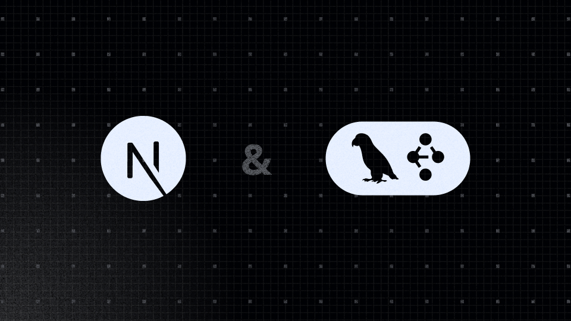

[Create AI agent with LangGraph](#create-ai-agent-with-langgraph)[What is LangGraph](#what-is-langgraph)[How to build an AI agent](#how-to-build-an-ai-agent)[Create agent API](#create-agent-api)[Create web application with Next.js](#create-web-application-with-nextjs)[Next.js features](#nextjs-features)[Agent integration](#agent-integration)[Building the client app](#building-the-client-app)

Today, everyone is building AI-featured applications. There are many ways to utilize Large Language Models in your app, ranging from simple API calls to using frameworks. The next question is which technology to choose for building the frontend of your application. Traditionally, AI frameworks are built using Python, while JavaScript is a popular choice for web frameworks. After completing several projects, we've settled on a setup that works well for us.

For AI, we adopt an agent-based approach that elevates the capabilities of modern LLMs to the next level. This approach is quite flexible, allowing for greater control over the LLM when needed or enabling it to choose how to solve a problem independently. Several good frameworks for building agentic applications are available on the market, such as CrewAI, AutoGen, PydanticAI, and LangGraph. In my opinion, LangGraph is the most sophisticated option, offering exceptional flexibility, excellent tools, and all the necessary features to develop AI applications.

For the frontend, we prefer Next.js. It is an excellent full-stack framework that provides everything needed to build modern web applications.

Integrating LangGraph with Next.js is not straightforward. The first issue is that LangGraph is a Python framework, while Next.js is a JavaScript framework. Therefore, we need an API on top of LangGraph to use it with Next.js. The next challenge is synchronizing LangGraph’s state with the frontend application and making it convenient for developers to work with.

In this blog post, I will describe the technical details of the solution we made. Alternatively, you can check out the [Git repository](https://github.com/akveo/ai-cookbook) right away!

## Create AI agent with LangGraph

### What is LangGraph

LangGraph is a library for building stateful applications with LLMs. It can be used to create AI agent and multi-agent systems or to establish predefined code paths around LLM calls. The framework offers low-level control over flow execution, providing flexibility in its usage. You define your graph where nodes are essentially functions containing your custom code. Then, you establish edges between those nodes. The graph has a state, which is simply a dictionary of key-value pairs. This state updates after each node execution.

LangGraph has a plenty cool features:

- **Persistence.** It saves the state of the graph before and after node execution as a checkpoint. You can replay or fork graph execution from a specific checkpoint. If you are creating a simple chatbot app, there is no need to develop save message logic; it is already handled in LangGraph.
- **Human-in-the-loop.** It is one of the crucial features in AI agent development. Graph execution can be interrupted and resumed after user input. Asking users for confirmation before executing important actions is a good practice. For instance, when building a booking service, the agent finds hotel suites that meet user requirements, then asks for user confirmation to proceed. Only after receiving a positive response does it call the booking API to make a reservation.
- **Streaming.** The nature of LLMs is that they do not answer immediately, especially when generating long outputs. One common UX pattern for AI applications, particularly chatbots, is streaming. This means displaying part of the response as soon as it becomes available.
- **Sub graphs.** LangGraph allows the use of other graphs as nodes within the graph. This powerful approach enables feature reuse. Imagine you have a RAG agent app for searching information in your documents or on the web. You can easily integrate this AI agent into a new research agent by simply adding it as a node to the graph.
- **Tooling.** Debugging LLM applications is not an easy task. That's why having tools for evaluation and monitoring is essential. LangGraph Studio is a desktop application that allows developers to visualize the graph app and run it from a specific point. LangSmith is a monitoring and evaluation platform for your AI applications.
- **Community.** LangGraph is built on LangChain, one of the most popular frameworks for working with LLMs. There is a vast array of components created by the community that can be used in LangGraph.

### How to build an AI agent

There are many definitions of AI agents. Personally, I prefer this one: an agent is a system that uses AI to determine the control flow of an application. As developers, we describe how the system should behave and what tools it has access to. In real-life cases, it is more complex, but we will examine a simplified example.

Let’s build an assistant which can tell realtime weather and create reminders. We will have the following architecture: LLM with two tools: weather and reminder.

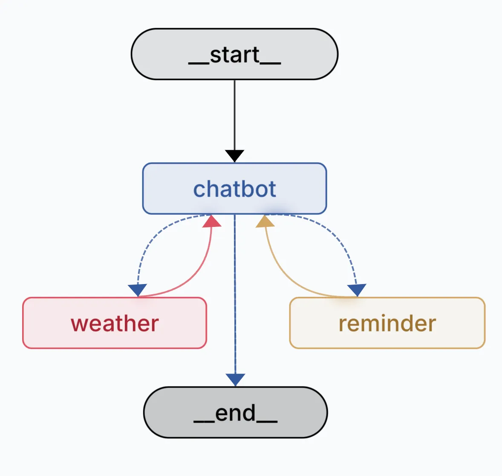

The definition of tools is quite straightforward. We describe what a tool does and its input parameters. Don’t be confused by the return statement on the screen; it is only for testing purposes. In real life, the weather tool should use a web search service or a weather API. And the reminder tool should create reminders in the database.

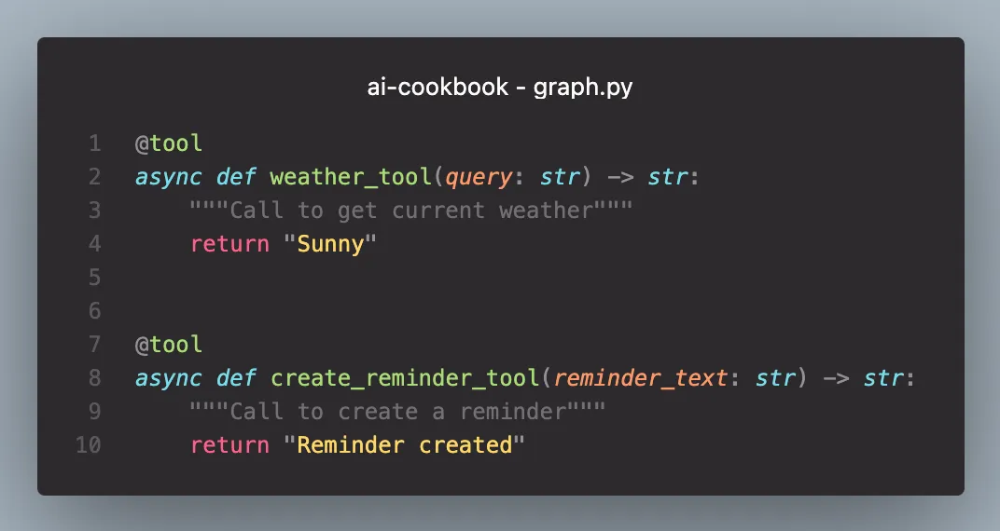

LLM decides when and which tools to use based on user input. For example, if a user asks, “What is the weather in LA and SF?”, LLM understands that it should call the weather tool twice: first to check the weather in Los Angeles and then to check the weather in San Francisco.

But it can involve more complex scenarios. Imagine a user asking the assistant, “What is the forecast for this weekend? If it is rainy, remind me to buy a raincoat.” The flow will look something like this:

- The LLM will ask the user about their location
- After the user provides their location, it will call the weather tool
- If the weather tool indicates rainy weather, it will then call a reminder tool to create a reminder.

The entire program flow is determined by AI. Awesome, isn’t it?

### Create agent API

Our LangGraph AI agent is written in Python, and we cannot use it directly in our Next.js application. We need an API to allow client apps to utilize it. For this purpose, we used the FastAPI framework.

There are several endpoints client application might need:

- POST /agent - main endpoint to run or resume agent execution.
- POST /agent/stop - initiates agent stop.
- GET /history - returns the list of graph checkpoints. This list is used to restore the graph execution runs for display on the UI.

## Create web application with Next.js

To build our end-user web app, we are using Next.js. This popular React-based framework offers a comprehensive solution for creating modern web applications. At Akveo, we utilize Next.js to deliver solutions to our clients quickly. We also build our internal apps with it. As a full-stack framework, it includes all the necessary built-in features, allowing you to start building without spending time on configuration.

### Next.js features

Here are the advantages of the framework:

- **Server-Side Rendering (SSR)**: Improves SEO and performance by rendering pages on the server before sending them to the client.
- **Static Site Generation (SSG)**: Allows pre-rendering of pages at build time, resulting in faster load times.
- **API Routes**: Simplifies backend integration by allowing you to create API endpoints within the same application.
- **Automatic Code Splitting**: Only loads the necessary JavaScript for the page being accessed, enhancing performance.
- **File-Based Routing**: Simplifies routing by using the file system, making it easy to create and manage routes.
- **Built-in CSS and Sass Support**: Offers support for global and modular CSS, as well as Sass, without additional configuration.
- **Image Optimization**: Automatically optimizes images for better performance and user experience.
- **Rich Ecosystem**: Integrates well with React and has a large community and ecosystem of plugins and tools.

### Agent integration

First, let's explore what the execution of the graph (our AI agent) means. LangGraph creates checkpoints before app execution, before each graph node, and after app execution. A checkpoint is essentially a snapshot of the graph's state, indicating which node or nodes will be executed next. Here is a screenshot from LangGraph Studio illustrating an execution example. In the right panel, the grey rectangles represent the checkpoints, while the circles indicate the nodes that were executed. You can inspect both the state of the checkpoint and the individual nodes.

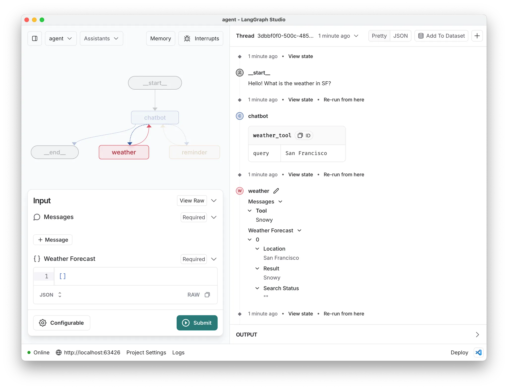

To gain full control and access graph execution data, we need to replicate this architecture in the client app. The logic is encapsulated in the `useLangGraphAgent` hook, which calls the AI service API and syncs the agent state on the client side.

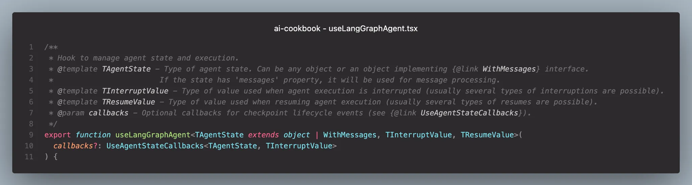

Using the exposed methods and objects from the hook, we can build any application logic and user interface based on them. Here is the description.

Properties:

- **status**: indicates the agent's execution status
- **appCheckpoints**: a list of graph checkpoints and nodes with their states

Methods:

- **run**: executes the agent with the provided state
- **resume**: continues agent execution after human interaction
- **restore**: retrieves the checkpoint history of a specific agent thread
- **replay**: re-executes the agent from a checkpoint
- **fork**: creates a fork of the checkpoint with a custom state and runs the agent

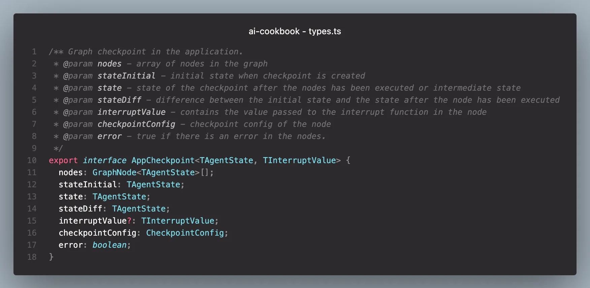

`appCheckpoint` is the foundation of our app logic. Let’s explore its properties.

- **nodes**: the list of nodes executed in this checkpoint.
- **stateInitial, state, stateDiff**: these store the checkpoint state before and after node execution, along with a state difference for convenience.
- **interruptValue**: this value is used in human-in-the-loop cases. It holds the interruption value from the graph, such as a prompt for user confirmation.
- **checkpointConfig**: configuration required for graph replies or forks.
- **error**: indicates whether an error occurred in one of the child nodes.

### Building the client app

The final step is to build a user interface for interacting with our AI agent. The most common user experience for communicating with AI is through a chat. When the user submits a new message, we call the `run` method of the `useLangGraphAgent` hook. While the agent is executing, new data streams from the AI service to the client app, and the `appCheckpoints` array is populated. The only remaining task is to render chat messages based on the `appCheckpoints`array.

We iterate over the checkpoints array and then over each node within a checkpoint. Based on the node name, we select the appropriate React component to render and pass only its relevant piece of state to the component.

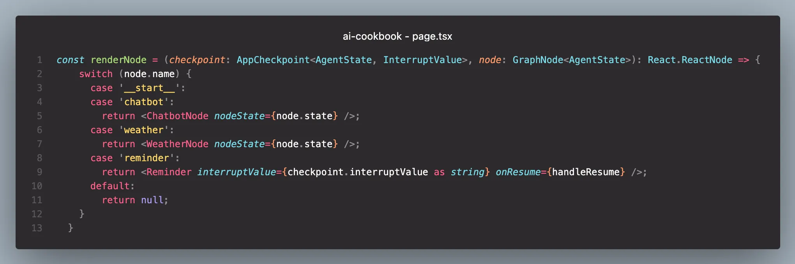

For a chatbot node, we use the `ChatbotNode` component, which renders messages from either humans or AI.

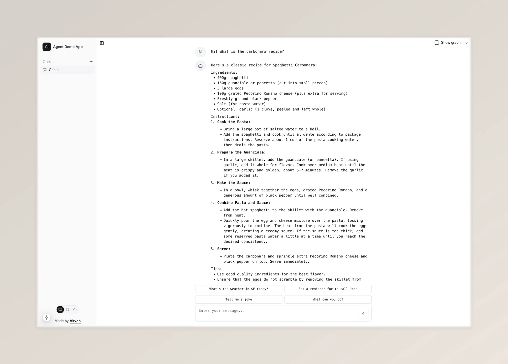

However, things become interesting when the agent path leads to other nodes. In the weather node, we can display not just a text message but also a visually appealing animated weather widget.

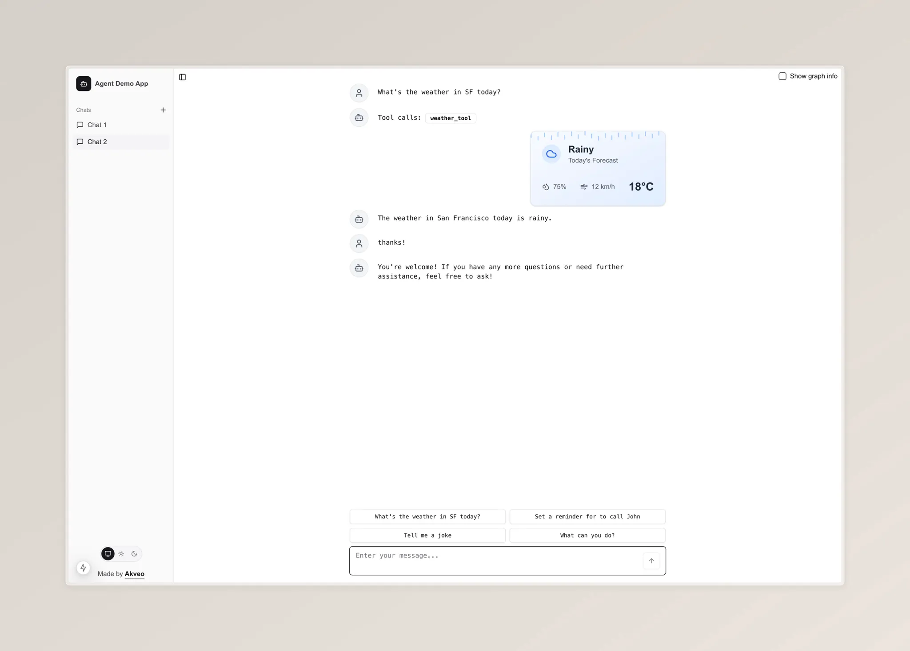

When the app flow reaches the reminder node, the agent's execution is interrupted, and we wait for user feedback. In this case, we can render a card with confirmation text and possible actions.

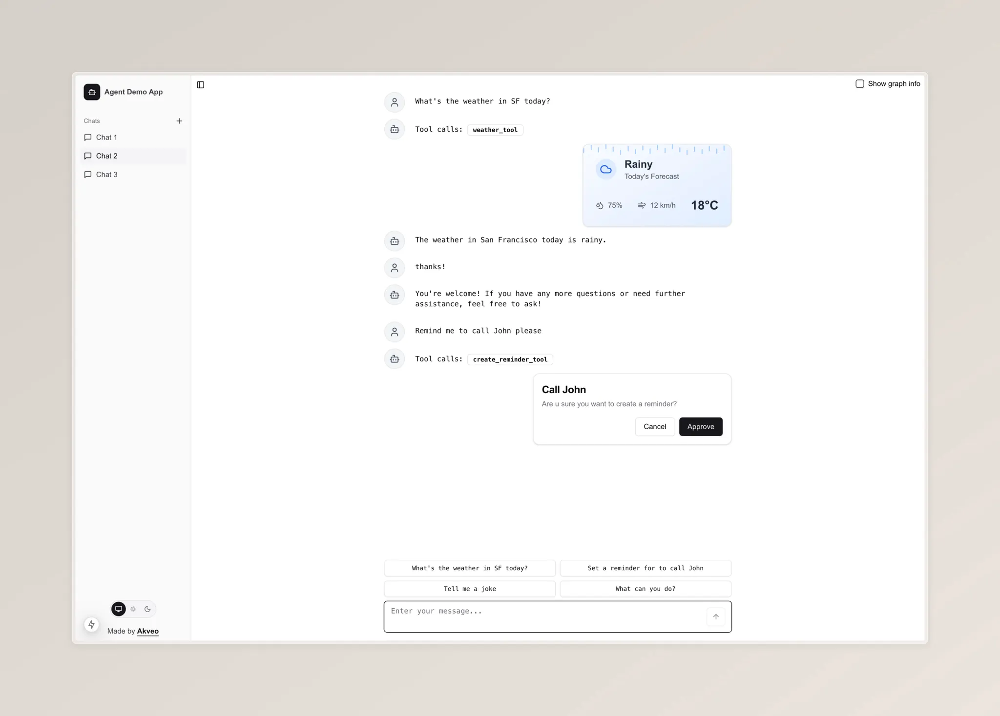

Another feature worth mentioning is that LangGraph has a built-in persistence layer, so we do not need to implement the logic for saving chat messages from scratch. Each agent execution is saved to its own thread. We simply need to call the `restore` method of the `useLangGraphAgent` hook with the `threadId` parameter. This will invoke the AI service and populate the appCheckpoints array.

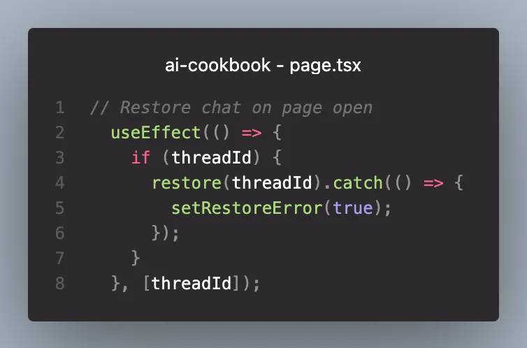

## Summary

We created an AI agent using LangGraph and built a user interface for it with Next.js. I hope this inspires you to develop your own applications with AI features. Simply clone the [akveo/ai-cookbook](https://github.com/akveo/ai-cookbook) repository; it will serve as a great starting point for your ideas.
